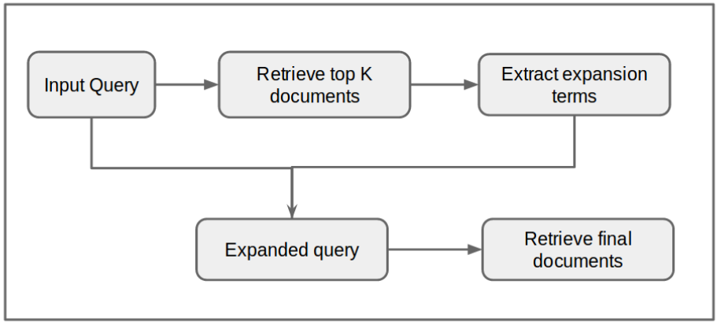

## Proyecto de Sistema de Información
### Modelo Vectorial Generalizado
Curso 2018-2019

>>**Resumen:** Sistema de Recuperación de Información(SRI) basado en el modelo vectorial generalizado, programado en python. El SRI está compuesto por los 4 módulos fundamentales: Procesamiento de Texto, Modelado, Index e Interfaz. Se implementaron como funcionalidades extras: Crawling, Expansión de consulta y Recomendación de documentos. Estos módulos son independientes, los cuales se comunican entre sí haciendo uso de la biblioteca json, lo que permite escalar fácilmente y mejorar el rendimiento. Con el objetivo de evaluar el SRI fueron implementados los criterios de evaluación pertinentes.

**Keywords:** sistema de recuperación de información, modelo vectorial generalizado, crawling, expansion de consulta, index, json.

#### 1. Requerimientos de software
        Python 3.7 
        PyQt 5
        nltk 3.0
        sklearn

#### 2. Interfaz Visual
> El objetivo de este módulo es ofrecerle al usuario una manera fácil de interactuar con el SRI. Para construir este módulo nos apoyamos en ***PyQt5***. ***PyQt5*** es una herramienta que permite construir interfaces gráficas de una manera relativamente fácil dado que cuenta con un diseñador y convierte el diseño a código python donde luego programamos la lógica. Nuestro diseño cuenta con dos pestañas principales, elección del repositorio(local search, web search) y consulta. 

> La pestaña designada a la elección del repositorio permite al usuario escoger entre hacer una búsqueda local en su computadora o una búsqueda con información de la web, para esta última, el usuario puede escoger el sitio o los sitios web en la red de los cuales quiere hacer recuperación de información, así como la profundidad de navegación por los links de estas páginas. La siguiente pestaña es donde el usuario va a realizar su consulta y posteriormente evaluar el modelo, teniendo la oportunidad de seleccionar de entre todos los documentos aquellos que considere relevantes.
>
#### 3. Crawling

#### 4. Procesamiento de Texto
>Para poder implementar mecanismos de recuperación sobre una colección de documentos de texto es necesario obtener una representación de los mismos. Con el objetivo de lograr dicha representación seguimos un conjunto de pasos para dejar solo los términos de los textos que van hacer útil para la posterior recuperación de información, lo cual además, hace muy mucho más rápido el trabajo con el modelo. 

>Haciendo uso de la librería ***re*** de python para el trabajo con patrones en strings, reemplazamos todos las posibles contracciones que se utilizan en el idioma inglés por su respectiva forma correcta(Ejemplo: you're--you are, aren't-- are not), luego utilizando nltk eliminamos todas las stopwords(palabras que no aportan significado) y signos de puntuaciones. Haciendo uso de la biblioteca ***langdetect*** de python averiguamos el idioma del texto o de la consulta para un mejor ***stemming*** utilizando la clase ***SnowballStemmer*** de ***nltk***, la cual nos reduce en gran medida la cantidad de términos con los que vamos a trabajar. Devolviendo una lista de tokens, para su posterior utilización.

#### 5. Expansión de Consulta
>#### 5.1 Expansion de Consultas basado en WordNet

>> WordNet es una base de datos léxica para múltiples idiomas. Los términos similares de varios idiomas se conectan mediante synsets (conjunto de sentidos). WordNet se puede usar para obtener términos relacionados para un término en particular en varios idiomas y puede ayudar a satisfacer la necesidad de información del usuario.

>>Por lo que apoyándonos en WordNet, agregamos a la consulta inicial del usuario aquellas palabras que presenten mayor similaridad con los términos de la consulta.

>#### 5.2 Expansion de Consultas basado en Relevance FeedBack 
>>Los métodos basados ​​en Relevance feedback ejecutan la consulta inicial en el repositorio y extraen los mejores k documentos. Luego, dos documento obtenidos se utilizan para mejorar el rendimiento de la recuperación. Se supone que los documentos iniciales recuperados son relevantes y, por lo tanto, se pueden usar para extraer términos de expansión. Estos modelos fallan cuando el algoritmo de recuperación inicial del motor de búsqueda es deficiente.

>>#### 5.2.1 Pseudo Relevance FeedBack (PRF)
>>> En los modelos basados ​​en Pseudo Relevance Feedback, la consulta inicial se activa y se obtienen los mejores k resultados. Luego los términos importantes, en nuestro caso basados ​​en co-ocurrencia, de estos documentos son extraídos y añadidos a la consulta. Luego, está consulta expandida se vuelve a activar para recuperar el conjunto final de documentos que están disponibles para el usuario. La relevancia de los términos de expansión depende de los documentos iniciales recuperados.

>>>

#### 6. Modelado

#### 7. Index
>El módulo Index fue implementado utilizando un diccionario privado. Este se encarga de almacenar de una manera eficiente toda la información que a la postre utilizará el SRI. Tenemos como método principal ***start (json_request)*** cuya función es recibir todas las entradas en formato ***json*** y llamar a los métodos pertinentes. En nuestro caso además de los métodos obligatorios implementamos un método llamado ***__all_term_doc(doc)*** que devuelve todos los términos que pertenecen a ese documento. La estructura de nuestro diccionario queda de la siguiente forma:
```python
index = {'term1': {'idf': 0.3,
                  'documents':{
                               {'doc1':{'tf':0.5,
                                        'weight':0,
                                        'minterm': 010..00
                                        }
                               {'doc2':{'tf':0.5,
                                        'weight':0,
                                        'minterm': 0110..00
                                        }
                               },
                    'index_in_vector': 5
                    }
         'term2': {'idf': 0.3,
                  'documents':{
                               {'doc1':{'tf':0.5,
                                        'weight':0,
                                        'minterm': 010..00
                                        }
                               {'doc2':{'tf':0.5,
                                        'weight':0,
                                        'minterm': 0110..00
                                        }
                               },
                    'index_in_vector': 6
                    }
           ...         
        }

```


#### 8. Medidas de Evaluación
Dado que existen sistemas basados en diferentes modelos y algoritmos, se necesitan criterios que permitan medir los parámetros de funcionamiento que valoran al sistema y además posibiliten la comparación entre distintos SRI. Para nuestro modelo implementamos las siguientes medidas de evaluación:
- Precisión
- Recobrado
- F-Medida
- E-Medida
- R-Precisión

Estas medidas pueden ser calculadas por el usuario una vez halla realizado la consulta, tal como se muestra en la interfaz visual.

#### 9. Referencias
1. Baeza-Yates, R., Ribeiro-Neto, B.: Modern Information Retrieval. Addison-Wesley Longman Publishing Co., Inc., Boston, MA, USA (1999)
2. Mills J. Y Keen M Cleverdon, C.W. Factors determining the performance of indexing systems. ASLIB Cranfield Project. Vol. 1, Design, Vol2, Test Results, 1996. 
